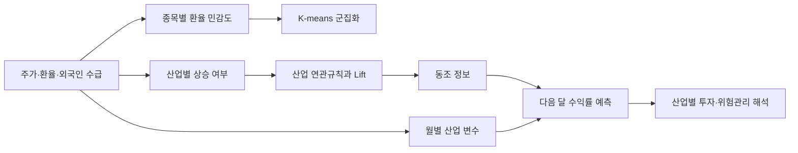

# FX Sensitivity & Industry Return Prediction

[](https://github.com/minster0422/fx-industry-return-prediction/actions/workflows/ci.yml)

2025년 학부 2학년 1학기 데이터마이닝 팀 프로젝트에서 출발해, 수업 프로젝트 1위와 KSCI 학술발표 논문 게재로 이어진 연구를 **그대로 미화하지 않고 재구성한 저장소**다. 당시의 좋은 아이디어를 보존하고, 논문·PPT·발표 대본·R 코드·CSV가 서로 달랐던 지점을 감사한 뒤, 미래정보 누수를 막은 V2 연구 설계와 실행 코드를 제공한다.

> 이 저장소의 목적은 과거 결과를 그대로 정답으로 선언하는 것이 아니라, 무엇을 생각했고 무엇을 실제로 구현했는지 분리한 뒤 더 좋은 연구로 발전시키는 것이다.

## 현재 릴리스 상태

| 범위 | 상태 |
|---|---|
| 포트폴리오 릴리스 `v0.2.0` | **완료** — 2025 재구성, 불일치 감사, V2 기준선, V2.1 사전등록·데이터 가능성 시험·수집기 골격 |
| V2 proof-of-concept | **완료** — 24개월 표본에서 네트워크 증분가치 미확인 |
| V2.1 장기 데이터 실증 | **향후 연구** — 공식 기업행사·공개시각·산업분류·재배포 근거 확보 전까지 미실행 |

채용·포트폴리오 관점의 핵심 요약은 [`docs/PORTFOLIO_SUMMARY.md`](docs/PORTFOLIO_SUMMARY.md)에 정리했다. 현재 릴리스는 미완성 실증을 완성된 결과처럼 제시하지 않는다. 대신 원래 아이디어, 재현 감사, 음의 기준선 결과, 사전등록과 안전한 데이터 수집 설계까지를 검증 가능한 산출물로 마무리한다.

## 프로젝트 한눈에 보기

| 구분 | 내용 |
|---|---|
| 출발점 | 2025년 학부 2학년 데이터마이닝 팀 프로젝트 |
| 성과 | 수업 프로젝트 1위, 2025 KSCI 학술발표 논문 게재 |
| 핵심 질문 | 환율에 비슷하게 반응하는 종목과 산업의 관계가 다음 달 산업 수익률 예측에 도움이 되는가? |
| 2025 접근 | 환율 민감도 군집화 → 산업 연관분석 → Random Forest 예측 |
| 현재 저장소 | 2025 결과 재구성·감사, Python 실행 코드, 누수 없는 V2 기준선, 테스트와 CI |
| 현재 결론 | 24개월 표본에서는 네트워크 신호의 유의미한 증분가치를 입증하지 못함 |

이 프로젝트의 포트폴리오 가치는 높은 예측 정확도 하나에 있지 않다. **서로 다른 분석을 하나의 문제 해결 흐름으로 연결한 설계**, 탐색적 관계를 예측변수로 전환한 시도, 그리고 후속 재검증에서 오류와 한계를 숨기지 않고 재현 가능한 연구문제로 바꾼 과정에 있다. 2025 결과는 팀의 공동 산출물이며, 이 저장소는 그 공동 성과와 후속 재구성을 구분해 기록한다.

## 2025년에 떠올린 핵심 아이디어

환율 충격에 비슷하게 반응하는 종목을 군집화하고, 함께 움직이는 산업 관계를 수치화해 다음 달 산업 수익률 예측에 활용한다.



좋았던 점은 세 분석을 나열하는 데서 끝나지 않고, **탐색적 분석에서 발견한 산업 관계를 예측변수로 다시 사용하려 했던 것**이다. 환율 민감도, 외국인 수급, 산업 네트워크를 하나의 이야기로 연결한 뼈대는 V2에서도 유지한다.

## 재구성 감사에서 확인한 내용

| 항목 | 2025 자료의 설명 | 코드·데이터 재검산 결과 |
|---|---|---|
| 데이터 | 2023-05~2025-04, 50종목 | 24,300행, 486거래일, 50종목 확인 |
| 군집 수 | Elbow와 Silhouette로 `k=4` | 현재 Python 포트의 최고 Silhouette는 `k=2`; `k=4`는 0.348 |
| 산업 연관규칙 | 제공된 24개월 이진행렬에서 계산 | 보고된 10개 규칙의 수치가 같은 행렬 재계산값과 모두 불일치 |
| `mean_corr` | 산업 동조를 반영하는 월별 변수 | R 코드는 종목별 월간 `하루라도 상승`을 사용해 Lift 최대 1.0, 모든 `mean_corr=0` |
| 예측 월 | 2024-05부터 다음 달 예측 | 코드의 2024-05 행은 실제로 2024-06 수익률을 목표로 하며 그래프 월이 한 달 앞섬 |
| 성능 향상 | `mean_corr`로 오차 5~17% 감소 | 해당 실행 경로에서는 변수가 전부 0이므로 이 주장을 재현할 수 없음 |

자세한 근거와 수치 비교는 [`docs/RECONSTRUCTION_AUDIT.md`](docs/RECONSTRUCTION_AUDIT.md)에 정리했다.

## 저장소가 제공하는 두 버전

### V1 — 2025 구조 재현

- 환율 수익률에 대한 종목별 회귀계수 β 계산
- 평균 수익률·외국인 지분율 변화·β의 K-means 군집화
- 제공된 산업 이진행렬에서 Support·Confidence·Lift 재계산
- 2025 `mean_corr` 생성 코드의 실제 동작 감사
- 12개월부터 시작하는 expanding-window Random Forest 포트
- `feature_month`와 실제 `target_month`를 동시에 저장

Python과 R의 Random Forest 구현 차이 때문에 예측 숫자를 완전히 동일하게 만들었다고 주장하지 않는다. 대신 변수 정의, 학습창, 타깃 이동, 평가 범위를 실행 가능한 형태로 고정한다.

### V2 — 누수 없는 업그레이드

- 같은 달 동조가 아니라 `산업 A의 t월 → 산업 B의 t+1월` 시차 관계 사용
- 각 예측 시점까지 관측된 과거만으로 관계를 다시 계산
- 선택된 선행 산업의 현재 수익률을 `network_signal`로 구성
- Zero, 직전 수익률, 기본 RF, 네트워크 RF를 같은 Walk-forward 구간에서 비교
- RMSE뿐 아니라 MAE와 방향 적중률을 함께 기록

V2는 완성된 투자모형이 아니라, 원래 아이디어를 검증 가능한 연구문제로 바꾸는 첫 기준선이다. 장기 데이터와 통계적 유의성 검정이 추가되어야 한다.

### V2.1 현재 단계 — 사전등록 프로토콜 초안

V2.1은 **아직 전체 데이터 수집·모델 학습·성능 평가 전**이다. 결과를 보기 전에 표본, 다음 달 산업 초과수익률 타깃, 60개월 rolling 학습창, M0~M4 비교, paired MAE, month-block bootstrap, 실패 판정 규칙을 [`docs/V2_1_PROTOCOL.md`](docs/V2_1_PROTOCOL.md)와 [`configs/v2_1_protocol.yaml`](configs/v2_1_protocol.yaml)에 고정했다.

2026-07-20 기준 KRX 인증과 6개 서비스 승인을 완료했고, U0 Legacy-50을 공식 코드로 50/50 식별했다. 명칭이 바뀐 HDC/IPARK현대산업개발은 동일 코드·ISIN provenance로만 연결했으며, 고정 5종목의 2026-04-01~06-30 일별 시세 305행과 KOSPI 61행에서 결측·중복·숫자 변환 실패가 모두 0임을 확인했다. U1 Expanded-10은 과거 업종 구성·종목 계보·기업행사 조정 문제가 남아 V2.2 후보로 이관한다. 기업행사 조정, KRX·ECOS 공개시각 관측, KRX 산업지수 구성 정의가 미해결이므로 상태는 `DRAFT — NOT FROZEN`이며 V2.1 target·예측·성능 결과는 아직 생성하지 않는다.

데이터 가능성 점검은 별도 제한 CLI로 실행한다. 이 명령은 모델이나 `results/v2_1/`을 생성하지 않는다.

```powershell
python -m fx_research.v2_1_feasibility `
  --config configs/v2_1_protocol.yaml `
  --mode audit
```

U0 전체수집 전 계획과 dry-run은 별도 수집기 골격으로 확인한다. 2026-07-20 계획 기준 평일 후보일 4,302일, KRX 요청 상한 12,908회, KRX 로컬 저장 추정 약 2.16GB이며 실제 거래일·응답 크기·압축률에 따라 달라진다. ECOS 4개 계열은 평일 행 상한 17,208행만 표시하고, 호출 수·원시 저장량은 UNRESOLVED-03이 닫히기 전 추정하지 않는다. 프로토콜 동결과 frozen manifest가 없으므로 `collect` mode는 실행되지 않는다.

```powershell
python -m fx_research.v2_1_collection --mode plan
python -m fx_research.v2_1_collection --mode dry-run
```

### 현재 V2 proof-of-concept 결과

24개월 표본에서 전체 110개 Walk-forward 예측을 합쳐 비교하면 기본 RF의 RMSE는 약 `0.003712`, 네트워크 RF는 약 `0.003701`이었다. 차이는 약 0.3%로 매우 작고, 0을 예측하는 기준선의 RMSE가 약 `0.003552`로 더 낮았다. 즉 현재 표본에서는 네트워크 신호의 실질적인 증분가치를 입증하지 못했다. 방향 적중률은 기본 RF 약 48.2%, 네트워크 RF 약 49.1%였다.

이 결과는 실패를 숨기지 않는 기준선이다. 장기 데이터, 변동성 대비 스케일링, 통계적 검정 없이 성능 향상을 주장하지 않는다.

## 실행 방법

원본 `merged_50stocks_fx_multi.csv`는 출처와 재배포 조건이 확정되지 않아 Git에 포함하지 않았다. 로컬의 `data/raw/`에 넣거나 `--input`으로 경로를 지정한다.

```powershell
python -m venv .venv
.venv\Scripts\Activate.ps1
python -m pip install -e .

fx-research `
  --input data/raw/merged_50stocks_fx_multi.csv `
  --output results/generated `
  --trees 300
```

테스트:

```powershell
python -m unittest discover -s tests -v
```

실행 결과는 다음처럼 생성된다.

```text
results/generated/
├─ summary.json
├─ reconstruction/
│  ├─ cluster_assignments.csv
│  ├─ association_rules_reconciliation.csv
│  ├─ legacy_mean_corr.csv
│  ├─ legacy_predictions.csv
│  ├─ legacy_metrics_latest6.csv
│  └─ published_vs_python_metrics.csv
└─ v2/
   ├─ monthly_panel_with_network_signal.csv
   ├─ predictions.csv
   ├─ metrics_latest6.csv
   └─ metrics_all_walk_forward.csv
```

## 문서 안내

- [`docs/RESEARCH_STORY.md`](docs/RESEARCH_STORY.md): 당시 아이디어와 잘했던 점
- [`docs/PORTFOLIO_SUMMARY.md`](docs/PORTFOLIO_SUMMARY.md): 성과·개선·검증 결과·현재 완료선을 한 문서로 정리한 포트폴리오 요약
- [`docs/PRESENTATION_FLOW.md`](docs/PRESENTATION_FLOW.md): 발표 대본과 27장 PPT의 실제 흐름
- [`docs/VERSION_MAP.md`](docs/VERSION_MAP.md): 논문·PPT·대본·코드의 역할과 충돌 처리 원칙
- [`docs/RECONSTRUCTION_AUDIT.md`](docs/RECONSTRUCTION_AUDIT.md): 재현 과정에서 발견된 불일치
- [`docs/V2_RESEARCH_DESIGN.md`](docs/V2_RESEARCH_DESIGN.md): 업그레이드 연구 설계
- [`docs/V2_1_ROADMAP.md`](docs/V2_1_ROADMAP.md): 장기·최신 데이터로 진행할 후속 버전의 실행 기준
- [`docs/V2_1_PROTOCOL.md`](docs/V2_1_PROTOCOL.md): 결과 확인 전에 고정할 V2.1 사전등록형 연구 프로토콜
- [`docs/V2_1_DECISION_LOG.md`](docs/V2_1_DECISION_LOG.md): 주 분석 선택, 대안, 미해결 항목과 동결 이력
- [`docs/V2_1_DATA_DICTIONARY.md`](docs/V2_1_DATA_DICTIONARY.md): 필드별 단위·원천·관측 가능 시점·변환식
- [`docs/V2_1_DATA_FEASIBILITY.md`](docs/V2_1_DATA_FEASIBILITY.md): 공식 API·기업행사·공개시각·산업지수 가능성 감사
- [`archive_2025/README.md`](archive_2025/README.md): 2025 공개 산출물의 보존 원칙

## 버전 정책

- `v0.1 / V2 proof-of-concept`: 2025 연구의 재구성, 오류 감사, 24개월 데이터 실행 결과를 보존한다.
- `v0.2 / portfolio release`: V2.1 사전등록, 공식 U0 매핑, 제한 스키마 검증과 동결 전 전체수집을 차단하는 수집기 골격까지 공개한다.
- `V2.1`: 최소 5년의 장기·최신 데이터, 명확한 초과수익률 타깃, 강한 기준모형과 불확실성 검정을 갖춘 후속 연구로 분리한다.

V2.1을 기다리며 현재 결과를 감추거나 덮어쓰지 않는다. `v0.2.0`은 포트폴리오 릴리스로 완결하고, 장기 데이터 실증은 공식 근거와 프로토콜 동결 조건이 충족될 때 같은 저장소에서 비교 가능한 후속 버전으로 재개한다. 변경 내역은 [`CHANGELOG.md`](CHANGELOG.md)에 기록한다.

## 논문

이민성, 홍찬기, 추민주, 이석준, 우지영, **「환율 민감도 기반 클러스터링과 동조지수를 이용한 산업별 월간 수익률 예측」**, 한국컴퓨터정보학회 학술발표논문집, 33(2), 959–961, 2025.

- DBpia: <https://www.dbpia.co.kr/journal/articleDetail?nodeId=NODE12337990>

## 주의사항

이 프로젝트는 교육·재현 연구용이며 투자 조언이 아니다. 표본은 24개월로 매우 짧고, 고정된 50종목을 사용하므로 생존편향·표본선택 편향·시장국면 의존성이 크다.
