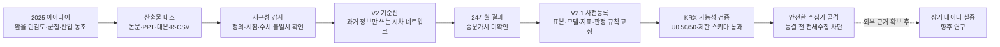

# 포트폴리오 요약

## 한 문장 소개

2025년 학부 팀 프로젝트의 환율 민감도·산업 네트워크 아이디어를 보존하되, 발표·논문·코드의 불일치를 직접 감사하고 누수 없는 기준선과 사전등록형 후속 연구로 다시 설계한 재현성 중심 계량금융 프로젝트다.

## 이 저장소가 보여주는 것

| 구분 | 2025 팀 공동 산출물 | 2026 개인 후속 재구성 |
|---|---|---|
| 문제 설정 | 환율에 비슷하게 반응하는 종목과 산업 관계를 다음 달 산업 수익률 예측에 연결 | 같은 질문을 시점 정렬, 강한 기준선, 불확실성 검정을 포함한 연구 질문으로 재정의 |
| 결과 | 수업 프로젝트 1위, KSCI 학술발표 논문 게재 | 원자료 구조 복원, 불일치 감사, Python 패키지·테스트·CI·V2 기준선·V2.1 사전등록 초안 |
| 핵심 강점 | 군집화·연관분석·예측을 하나의 문제 해결 흐름으로 연결 | 결과가 유리하도록 고르는 대신 데이터·변수·모델·평가·실패 기준을 결과 확인 전에 고정 |
| 한계 처리 | 24개월·수작업 50종목·문서와 코드의 버전 혼재 | 재현되지 않는 주장을 명시하고, 공식 근거가 없는 결정은 `UNRESOLVED`로 보존 |
| 책임 범위 | 논문과 2025 발표 결과는 팀 전체의 공동 성과 | 이 저장소의 감사·재구성·후속 프로토콜·수집기 설계는 개인 후속 작업 |

## 연구 흐름



중요한 개선은 모델을 복잡하게 만든 것이 아니라, 탐색적 아이디어와 검증 가능한 가설을 분리한 것이다. V2에서는 산업 A의 `t`월 정보로 산업 B의 `t+1`월을 설명하는 방향성 관계만 사용하고, 매 예측 시점까지 관측된 과거로 네트워크를 다시 추정한다. V2.1 초안에는 이 구조를 M0~M4 비교와 paired MAE, month-block bootstrap으로 검증하도록 명시했다.

## 확인된 결과

### 1. 2025 연구 재구성

- 원본 분석 표본은 2023-05~2025-04의 50종목, 486거래일, 24,300행이다.
- 제공된 산업 이진행렬로 연관규칙을 다시 계산했을 때 논문·발표에 보고된 10개 규칙의 수치와 일치하지 않았다.
- 당시 R 코드의 `mean_corr` 생성 경로에서는 산업 Lift 최대값이 1.0이고 최종 변수가 모두 0이 되어, 해당 변수로 오차가 감소했다는 설명을 그대로 재현할 수 없었다.
- 표시된 예측 월과 실제 타깃 월 사이에 한 달 차이가 있음을 확인하고 `feature_month`와 `target_month`를 명시적으로 분리했다.

### 2. 누수 없는 V2 기준선

24개월 표본의 110개 Walk-forward 예측에서 기본 Random Forest RMSE는 약 `0.003712`, 네트워크 Random Forest는 약 `0.003701`이었다. 그러나 0 예측 기준선 RMSE가 약 `0.003552`로 더 낮았다. 방향 적중률도 각각 약 48.2%, 49.1%였다.

따라서 이 저장소는 현재 표본에서 네트워크의 증분가치를 입증했다고 주장하지 않는다. 이 음의 결과는 V2.1에서 더 긴 기간, 명시적인 초과수익률 타깃, paired comparison과 불확실성 검정이 필요한 이유다.

### 3. V2.1 데이터·재현성 준비

- KRX 필수 6개 서비스 승인과 제한 API 시험을 완료했다.
- U0 Legacy-50을 공식 종목코드로 50/50 식별했고 중복 코드는 0개다.
- HDC/IPARK현대산업개발의 명칭 변경은 문자열 유사도가 아니라 동일 코드 `294870`과 ISIN `KR7294870001`로 연결했다.
- 고정 5종목의 2026-04-01~06-30 일별 시세 305행과 KOSPI 61행에서 결측, 날짜·종목 중복, 숫자 변환 실패가 모두 0이었다.
- 종목기본정보의 `ISU_SRT_CD`와 일별 시세의 `ISU_CD`가 서로 다른 API 스키마임을 반영하고 회귀 테스트를 추가했다.
- 연구용 전체수집기는 프로토콜 동결, 명시적 enable, frozen manifest가 모두 없으면 실행되지 않도록 설계했다.
- 별도의 archive-only 경로는 수익률·target·모델·예측·성능 생성을 코드에서 금지하고 endpoint allowlist, KST 일일 quota, SQLite checkpoint, SHA-256 검증과 동시 실행 lock을 적용했다.
- 2010-01-04~2026-06-30의 KRX 계획 12,908건과 유효 gzip 원본 12,908건을 일치시켰다. 총 9,301,468행이며 원자료는 로컬에만 보존한다.
- 현재 테스트 45개가 데이터 누수 방지, API 스키마, 자격증명 비노출, 금지 산출물, archive 파생 차단, 원자적 저장과 재시작 규칙을 검증한다.

## 결과물 지도

| 보고 싶은 내용 | 파일 |
|---|---|
| 연구의 전체 이야기 | [`RESEARCH_STORY.md`](RESEARCH_STORY.md) |
| 발표 대본과 PPT의 실제 흐름 | [`PRESENTATION_FLOW.md`](PRESENTATION_FLOW.md) |
| 2025 자료의 불일치와 재검산 | [`RECONSTRUCTION_AUDIT.md`](RECONSTRUCTION_AUDIT.md) |
| 누수 없는 V2 설계 | [`V2_RESEARCH_DESIGN.md`](V2_RESEARCH_DESIGN.md) |
| V2.1 사전등록형 프로토콜 | [`V2_1_PROTOCOL.md`](V2_1_PROTOCOL.md) |
| 데이터 가능성 시험 결과 | [`V2_1_DATA_FEASIBILITY.md`](V2_1_DATA_FEASIBILITY.md) |
| U0 전체수집 전 안전 설계 | [`V2_1_COLLECTION_PLAN.md`](V2_1_COLLECTION_PLAN.md) |
| KRX 원자료 보존 결과와 공개 경계 | [`V2_1_ARCHIVE_REPORT.md`](V2_1_ARCHIVE_REPORT.md) |
| 외부 근거 확보 후 재개할 항목 | [`V2_1_ROADMAP.md`](V2_1_ROADMAP.md) |

## 재현 명령

원본 데이터의 재배포 조건이 확정되지 않아 원자료는 저장소에 포함하지 않는다. 공개된 테스트와 안전성 감사는 원자료 없이 실행할 수 있다.

```powershell
python -m pip install -e .
python -m unittest discover -s tests -v
python -m fx_research.v2_1_feasibility `
  --config configs/v2_1_protocol.yaml `
  --mode audit
python -m fx_research.v2_1_collection --mode plan
python -m fx_research.v2_1_collection --mode dry-run
python -m fx_research.v2_1_archive --mode status
```

2025 재구성과 V2 결과는 로컬 원자료를 `--input`으로 지정할 때 한 명령으로 다시 생성할 수 있다. 자세한 실행법은 저장소 루트의 [`README.md`](../README.md)를 따른다.

## 현재 완료선

`v0.2.1`은 포트폴리오·원자료 보존 릴리스로서 다음 범위를 완료한다.

1. 2025 팀 프로젝트의 아이디어·발표 흐름·논문 결과를 보존했다.
2. 문서·코드·데이터의 불일치를 숨기지 않고 재구성 감사로 남겼다.
3. 누수 없는 V2 기준선과 그 음의 결과를 공개했다.
4. V2.1의 데이터·변수·모델·평가·판정 규칙을 결과 확인 전에 고정하는 초안을 만들었다.
5. U0 공식 매핑과 제한 KRX 스키마 시험을 통과하고, 안전한 전체수집 골격까지 구현했다.
6. 연구 파생을 전부 끈 별도 경로로 2010~2026 KRX 원자료 보존을 완료하고 공개 가능한 집계와 무결성 증거만 남겼다.

V2.1 실증 결과는 이 릴리스에 포함되지 않는다. 기업행사 조정, 과거 산업분류, 데이터 공개시각과 파생 결과 공개 범위에 관한 공식 근거가 없는데도 임의 가정을 넣어 결과를 만드는 것보다, 원자료만 보존하고 재개 조건을 명시해 멈추는 것이 연구적으로 더 정확하다.

## 향후 재개 조건

다음 공식 근거가 확보되면 [`V2_1_ROADMAP.md`](V2_1_ROADMAP.md)의 gate 순서로 재개한다.

- 분할·병합·감자를 포함한 가격 조정 정의와 검증 가능한 공식 사건 자료
- KRX·ECOS 일별 자료의 예측시점 기준 이용 가능 시각
- 기존 10개 산업과 공식 KRX 산업지수의 구성 정의
- 종목별 β·산업수익률·예측행 등 파생 통계의 공개 허용 범위

이 조건이 닫히기 전에는 프로토콜을 `FROZEN`으로 바꾸거나 보존 원자료의 연구용 변환·V2.1 모델 학습·성능 평가를 실행하지 않는다.

## 논문과 기여 구분

2025 논문은 이민성·홍찬기·추민주·이석준·우지영의 공동 산출물이다.

> 「환율 민감도 기반 클러스터링과 동조지수를 이용한 산업별 월간 수익률 예측」, 한국컴퓨터정보학회 학술발표논문집 33(2), 959–961, 2025.

- [DBpia 논문 페이지](https://www.dbpia.co.kr/journal/articleDetail?nodeId=NODE12337990)

현재 저장소는 공동 산출물을 개인 단독 성과로 바꾸지 않는다. 대신 후속 재구성에서 수행한 감사, 코드화, 누수 통제, 사전등록, 데이터 계보와 안전한 수집 설계를 별도의 개인 연구 역량으로 제시한다.
